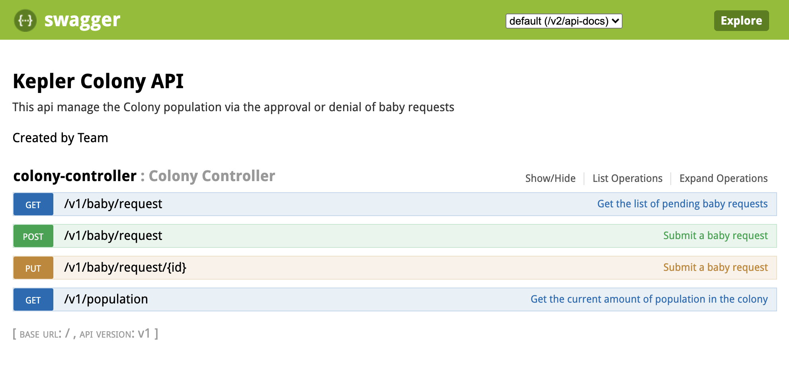

# Colony Kepler API

## Setup

It is using JDK11 as well as gradle 6.0.
Fully developed in Kotlin.

### Build

```bash
./gradlew clean build
```

### Run tests

Run the tests with coverage report

```bash
./gradlew clean test jacocoTestReport
```

### With docker

You can create the docker image using:

```bash
./gradlew clean build dockerBuild
```

Then you can run it using:

```bash
docker run -p 8103:8103 kepler-colony:latest 
```

And it will run on [localhost:8103](http://localhost:8103)

## Api Info

This api manage the Colony population via the approval or denial of baby requests.

- GET `/population`: To get the number of people in the colony
- POST `/baby/request`: To send a request to have a Baby.
- PUT `/baby/request/{id}`: To approve a deny a request to have a baby via its id.
- GET `/baby/request`: To get the list of pending requests.

You can start the app and check the swagger at [localhost:8103/swagger-ui.html](http://localhost:8103/swagger-ui.html#/colony-controller)



You can even try the app API from there.